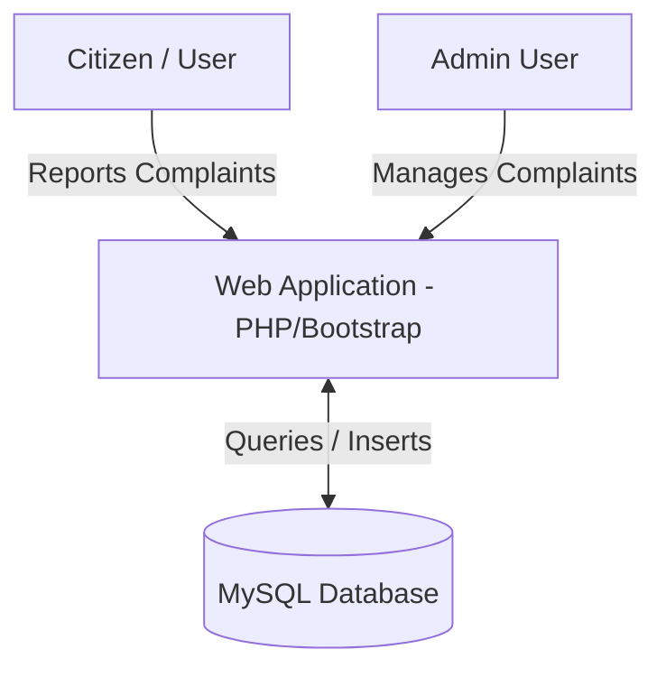

# Software Requirements Specification (SRS)
## For Smart Waste Management and Public Grievance System

---

## 1. Introduction

### 1.1 Purpose
The purpose of this document is to specify the software requirements for the **Smart Waste Management and Public Grievance System**. This system is designed to bridge the communication gap between citizens and municipal authorities regarding waste accumulation and public cleanliness issues.

### 1.2 Document Conventions
- This document follows standard SRS templates based on IEEE standards.
- UI elements and database structures are highlighted in code blocks.
- Warning/Note boxes indicate critical development details.

### 1.3 Intended Audience
This document is intended for:
- **Academic Evaluators/Examiners** reviewing the project submission.
- **Developers** modifying or extending the system.
- **System Administrators** deploying the application on hosting servers.

### 1.4 Project Scope
The system is a web-based portal designed to allow citizens to report waste-related issues in real-time. Key scopes include:
- Citizen registration and login.
- Grievance reporting with description, image upload, and real-time geographic location.
- An administrative panel to review, monitor, and update the status of registered grievances.
- Data persistence via a secure relational database.

---

## 2. Overall Description

### 2.1 Product Perspective
The Smart Waste Management and Public Grievance System is an independent, responsive web application. It operates in a client-server architecture:
- **Client (Frontend):** Responsive UI accessible on mobile phones, tablets, and desktops.
- **Server (Backend):** PHP application processing logic and routing requests.
- **Database:** MySQL database managing persistent user, admin, and complaint tables.

### 2.2 Product Functions
The system performs the following primary functions:
1. **User Authentication:** Registration, password verification, and session management.
2. **Geographical Location Capture:** Automated capture of GPS coordinates (latitude/longitude) using the browser's Geolocation API.
3. **Grievance Registration:** Citizen interface to report issues, categorizing them, writing descriptions, and uploading images.
4. **Dashboard View:** Real-time metrics for users to check the status of their complaints (Pending, In Progress, Resolved).
5. **Admin Monitoring Panel:** Centralized admin hub displaying overall system statistics, complaints logs, and user details.
6. **Workflow Updates:** Ability for admin officials to transition complaint statuses to track operations.

### 2.3 User Classes and Characteristics
- **Citizen (User):** Public users who register to post grievances. They require basic web browser skills and permission to access location settings.
- **Administrator (Admin):** Authorities who manage the grievances. They require administrative login credentials to access reports and update complaint statuses.

### 2.4 Operating Environment
- **Server OS:** Linux (Apache) or Windows (XAMPP / Apache).
- **Client Browsers:** Google Chrome, Mozilla Firefox, Microsoft Edge, Safari (latest versions).
- **Backend Environment:** PHP 8.0 or above.
- **Database Server:** MySQL 5.7 or above.

---

## 3. System Features & Functional Requirements

### 3.1 User Registration & Authentication
- **Description:** Allows new citizens to register by providing name, email, phone, and password. Allows registered users to log in securely.
- **Functional Requirements:**
  - Password values must be hashed using `password_hash()` (Bcrypt) before database storage.
  - Emails must be unique in the system.
  - Sessions must start upon successful login and terminate upon logout.

### 3.2 Complaint / Grievance Submission
- **Description:** Allows authenticated users to file complaints regarding waste issues.
- **Functional Requirements:**
  - The system must capture the user's GPS coordinates using the browser's Geolocation API.
  - The system must allow uploading of images (.jpg, .jpeg, .png) depicting the waste site.
  - The system must validate that all mandatory fields (Location, Issue Type, Description) are filled.

### 3.3 Admin Control Panel
- **Description:** Allows administrators to manage system operations.
- **Functional Requirements:**
  - The system must display high-level dashboard metrics (Total Complaints, Pending, In Progress, Resolved, and Total Users).
  - The admin must be able to update the status of any complaint.
  - The admin must be able to view user profiles and system reports.

---

## 4. External Interface Requirements

### 4.1 User Interfaces (UI)
- The frontend must be fully responsive using **Bootstrap 5**.
- Color palettes must focus on a clean look (green accents represent environment/cleanliness).
- Interactive forms must contain client-side validation to improve user experience.

### 4.2 Software Interfaces
- **PHP:** Serves pages and handles backend logic.
- **Composer/PHPMailer:** Integrated tool for email verification and alerts.
- **Google Safe Browsing / SSL:** The site must be served over HTTPS to ensure secure location capture and browser geolocation access.

### 4.3 Database Schema (MySQL)

#### Table: `users`
| Column Name | Data Type | Constraints | Description |
|---|---|---|---|
| `id` | INT | Primary Key, Auto Increment | Unique User ID |
| `name` | VARCHAR(100) | NOT NULL | Full Name of User |
| `email` | VARCHAR(100) | NOT NULL, UNIQUE | User Login Email |
| `phone` | VARCHAR(15) | NOT NULL | Contact Number |
| `password` | VARCHAR(255) | NOT NULL | Bcrypt Hashed Password |
| `created_at` | TIMESTAMP | DEFAULT CURRENT_TIMESTAMP | Date of Registration |

#### Table: `complaints`
| Column Name | Data Type | Constraints | Description |
|---|---|---|---|
| `id` | INT | Primary Key, Auto Increment | Unique Complaint ID |
| `user_id` | INT | Foreign Key (users.id) | User who filed the complaint |
| `issue_type` | VARCHAR(50) | NOT NULL | Type of waste issue |
| `location` | VARCHAR(255) | NOT NULL | GPS coordinates / Address |
| `description` | TEXT | NOT NULL | Details of the problem |
| `image` | VARCHAR(255) | Optional | Filename of uploaded image |
| `status` | VARCHAR(20) | DEFAULT 'Pending' | Current Status (Pending, In Progress, Resolved) |
| `created_at` | TIMESTAMP | DEFAULT CURRENT_TIMESTAMP | Date and Time of Complaint |

#### Table: `admin`
| Column Name | Data Type | Constraints | Description |
|---|---|---|---|
| `id` | INT | Primary Key, Auto Increment | Unique Admin ID |
| `username` | VARCHAR(50) | NOT NULL, UNIQUE | Admin Login Username |
| `password` | VARCHAR(255) | NOT NULL | Password |

---

## 5. Non-Functional Requirements

### 5.1 Security
- All sensitive input parameters must be sanitized using `mysqli_real_escape_string` or bound parameters using `mysqli_prepare` to prevent **SQL Injection**.
- SSL (HTTPS) must be enabled so data transferred between user browsers and the server is encrypted.

### 5.2 Usability
- The geolocation collection must occur seamlessly behind the scenes with a clean permission request prompt.
- Statuses must use recognizable color badges (e.g., Orange for Pending, Green for Resolved).

### 5.3 Performance & Availability
- Page load time must remain under 3 seconds under normal network conditions.
- Upload file sizes for images must be restricted (e.g., maximum 5MB) to optimize database space and load speeds.
